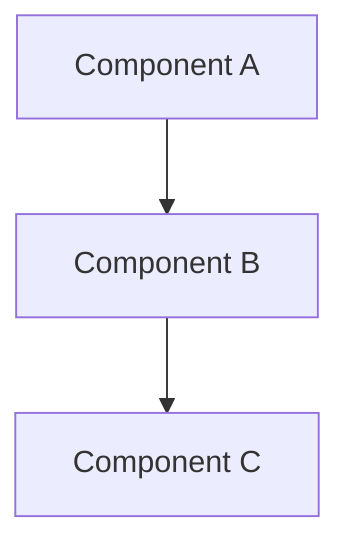

# Spec Planner Skill

Transform feature ideas into comprehensive, implementation-ready specifications.

## Overview

This skill guides you through creating structured specifications that bridge the gap between feature requirements and implementation. A good spec provides:

- **Clear requirements** with user stories and acceptance criteria
- **Detailed design** with architecture and data models
- **Actionable tasks** with implementation steps and validation criteria
- **Correctness properties** that define expected system behavior

## The Three Core Documents

Every spec consists of three essential files:

### 1. requirements.md
User stories, glossary, and acceptance criteria. Defines WHAT the feature should do.

### 2. design.md  
Architecture, data models, interfaces, and correctness properties. Defines HOW the feature works.

### 3. tasks.md
Implementation plan with tasks, subtasks, and checklists. Defines the STEPS to build it.

---

## Workflow

### Step 1: Understand the Feature

Gather essential context:

**Q1: What is the feature name?** (short, descriptive, kebab-case for folder)

**Q2: What problem does it solve?** (user pain point, missing capability)

**Q3: Who are the users?** (end users, developers, admins)

**Q4: What is the scope?** (MVP vs complete implementation)

**Q5: Are there existing specs to reference?** (similar patterns, conventions)

### Step 2: Gather Context

Check for:
- Existing `.specs/*/` directories (reference patterns)
- `AGENTS.md` or `README.md` (project conventions)
- Related code files (understand current architecture)
- Any existing documentation or design docs

### Step 3: Create the Spec Structure

Create directory: `.specs/{feature-name}/`

Create the three core files:
1. `requirements.md` - Requirements document
2. `design.md` - Design document  
3. `tasks.md` - Implementation plan

### Step 4: Write Requirements (requirements.md)

Template structure:

```markdown
# Requirements Document: {Feature Name}

## Introduction

[1-2 paragraphs explaining the feature, motivation, and scope]

---

## Glossary

Define domain terms used throughout the spec:

- **Term**: Clear definition relevant to this spec
- **Component**: What this component means in this context

---

## Requirements

### Requirement 1: [Short Descriptive Name]

**User Story:** As a [user type], I want [capability], so that [benefit].

#### Acceptance Criteria

1. THE system SHALL [specific mandatory behavior]
2. WHEN [condition], THEN [expected result]
3. IF [error condition], THEN [error handling]
4. THE [interface] SHALL be typed for compile-time validation

---

### Requirement 2: [Another Requirement]

[Same structure...]
```

**Writing Guidelines:**
- Use SHALL/SHOULD/MAY (RFC 2119) for requirement strength
- Number each requirement (R1, R2, R3...)
- Include both happy path and edge cases
- Write acceptance criteria that are testable
- Cross-reference throughout the spec

### Step 5: Write Design (design.md)

Template structure:

```markdown
# Design Document: {Feature Name}

## Overview

[High-level description of the solution approach and key decisions]

### Key Design Decisions

- **Decision 1**: Rationale for this choice
- **Decision 2**: Why this approach over alternatives

---

## Architecture



[Explain the data flow and component interactions]

---

## Components and Interfaces

### 1. [Component Name]

[Description of responsibilities]

```typescript
export interface ComponentInterface {
  method(param: Type): ReturnType;
}
```

---

## Data Models

### [Model Name]

| Field | Type | Description |
|-------|------|-------------|
| `field1` | `string` | What this field represents |
| `field2` | `number` | Purpose of this field |

---

## Correctness Properties

Properties are formal statements about system behavior that must always hold true.

### Property 1: [Name]

*For any* [input/condition], [system behavior] SHALL [expected outcome].

**Validates:** Requirements X.Y, Z.W

---

## Error Handling

| Scenario | Behaviour |
|----------|-----------|
| Error case 1 | How the system handles it |
| Error case 2 | Expected behavior |

---

## Testing Strategy

### Unit Tests
- Test case 1
- Test case 2

### Property-Based Tests
- Property 1: Test description
- Property 2: Test description
```

**Writing Guidelines:**
- Use Mermaid diagrams for architecture
- Define TypeScript interfaces for all public APIs
- Include 3-5 correctness properties
- Document error scenarios in a table
- Reference requirements in properties

### Step 6: Write Tasks (tasks.md)

Template structure:

```markdown
# Implementation Plan: {Feature Name}

## Overview

[Brief summary of implementation approach]

## Tasks

- [ ] 1. [Task Name]
  - [Specific implementation details]
  - _Requirements: X.Y, Z.W_

  - [ ] 1.1 [Subtask with specific criteria]
  - [ ] 1.2 [Another subtask]

- [ ] 2. [Next Task]
  [Same structure...]

## Notes

- Optional: Implementation tips
- Optional: Dependencies between tasks
- Optional: Testing approach
```

**Writing Guidelines:**
- Each task references specific requirements
- Break tasks into 2-4 hour chunks
- Include testing as part of implementation
- Mark optional subtasks
- Use checkboxes for progress tracking

### Step 7: Validate and Review

Before finalizing, verify:

- [ ] **Requirements Coverage**: All requirements have acceptance criteria
- [ ] **Design Coverage**: Design covers all requirements
- [ ] **Task Coverage**: Tasks implement all requirements
- [ ] **Property Coverage**: Properties validate key requirements
- [ ] **Type Safety**: TypeScript interfaces defined where needed
- [ ] **Error Handling**: All error scenarios documented
- [ ] **Cross-References**: Requirements ↔ Design ↔ Tasks are linked

---

## Document Templates

### Feature Spec

For new features and capabilities. See `templates/feature-spec/`.

**Focus:** User value, extensibility, integration points

### Refactor Spec

For systematic code refactoring. See `templates/refactor-spec/`.

**Focus:** Backwards compatibility, migration path, testing

### Bug Fix Spec

For complex bug fixes. See `templates/bugfix-spec/`.

**Focus:** Root cause, reproduction steps, prevention

---

## Best Practices

### Requirements Best Practices

✅ **DO:**
- Start with user stories
- Use precise language (SHALL/SHOULD/MAY)
- Include specific acceptance criteria
- Number for traceability

❌ **DON'T:**
- Write implementation details in requirements
- Use vague language like "should work well"
- Forget error scenarios

### Design Best Practices

✅ **DO:**
- Lead with "why" before "how"
- Use diagrams for complex relationships
- Define data models first
- Document trade-offs

❌ **DON'T:**
- Skip correctness properties
- Leave interfaces undefined
- Ignore error handling

### Tasks Best Practices

✅ **DO:**
- Reference requirements
- Break into small chunks
- Include testing
- Add checkpoints

❌ **DON'T:**
- Create giant multi-day tasks
- Skip validation steps
- Forget cross-references

---

## Writing Correctness Properties

Properties define universal behaviors:

```markdown
### Property N: [Name]

*For any* [condition/input], [system behavior] SHALL [expected outcome].

**Validates:** Requirements X.Y
```

**Types of Properties:**

1. **Invariants**: Always true (e.g., "count never exceeds 5")
2. **Post-conditions**: True after operation (e.g., "handler is invoked")
3. **Safety**: Bad things never happen (e.g., "no data loss")
4. **Liveness**: Good things eventually happen (e.g., "event is processed")

---

## Common Patterns

### Requirements Pattern

```markdown
### Requirement N: [Name]

**User Story:** As a [user], I want [action], so that [benefit].

#### Acceptance Criteria

1. THE system SHALL [behavior]
2. WHEN [trigger], THEN [result]
3. IF [error], THEN [handling]
4. THE [interface] SHALL be typed
```

### Design Pattern

```markdown
## Components and Interfaces

### N. [Component]

[Responsibilities]

```typescript
export interface InterfaceName {
  // Method with types
}
```
```

### Task Pattern

```markdown
- [ ] N. [Task Name]
  - Implementation details
  - _Requirements: X.Y, Z.W_

  - [ ] N.1 [Subtask]
  - [ ] N.2 [Subtask]
```

---

## Integration with Agent Workflow

When planning a feature:

1. **Understand** → Ask clarifying questions (Step 1)
2. **Research** → Check existing specs/code (Step 2)
3. **Structure** → Create directory and files (Step 3)
4. **Draft** → Write requirements → design → tasks (Steps 4-6)
5. **Validate** → Review completeness (Step 7)
6. **Iterate** → Get feedback and refine

---

## Tips for Success

1. **Start Small** - Write minimal spec, expand iteratively
2. **Reference Examples** - Copy patterns from existing specs
3. **Be Specific** - Use concrete values, not vague terms
4. **Test Early** - Include testing in design phase
5. **Document Trade-offs** - Explain why alternatives weren't chosen
6. **Validate Properties** - Write testable correctness properties
7. **Cross-Reference** - Link everything: tasks → requirements, properties → requirements

---

## Property-Based Testing

For critical properties, include tests using `fast-check`:

```typescript
// Tag: Feature: feature-name, Property N: Description
describe('Feature: feature-name, Property N: Description', () => {
  it('should hold for all inputs', () => {
    fc.assert(
      fc.property(
        fc.string(), // Arbitrary generator
        (input) => {
          const result = systemUnderTest(input);
          return propertyHolds(result);
        }
      ),
      { numRuns: 100 }
    );
  });
});
```
