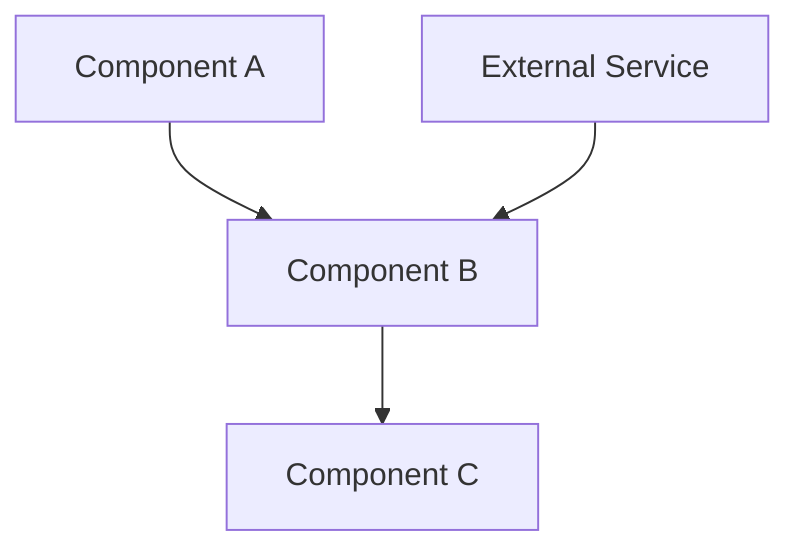

# Design Document: {Feature Name}

## Overview

[High-level description of the solution approach and key decisions]

Example:
> This design introduces a [component type] that [primary responsibility].
> The approach prioritizes [design goal] while maintaining [constraint].

### Key Design Decisions

- **Decision 1**: Rationale for this choice (e.g., "Use event-driven architecture for loose coupling")
- **Decision 2**: Why this approach over alternatives (e.g., "Singleton pattern for global state management")
- **Decision 3**: Trade-off explanation (e.g., "Eventual consistency acceptable for performance")

---

## Architecture



[Explain the data flow and component interactions]

---

## Components and Interfaces

### 1. [Primary Component]

[Description of responsibilities and role in the system]

```typescript
export interface PrimaryComponent {
  /**
   * Primary method description
   * @param param - Parameter description
   * @returns Return value description
   */
  method(param: Type): ReturnType;
  
  /**
   * Secondary method description
   */
  anotherMethod(): void;
}
```

---

### 2. [Secondary Component]

[Description of responsibilities]

```typescript
export interface SecondaryComponent {
  // Interface definition
}
```

---

## Data Models

### [Entity Name]

| Field | Type | Description |
|-------|------|-------------|
| `field1` | `string` | What this field represents |
| `field2` | `number` | Purpose of this field |
| `field3` | `boolean` | Default value and meaning |
| `timestamp` | `number` | Unix milliseconds |

---

### [Event / Message Type]

| Field | Type | Description |
|-------|------|-------------|
| `type` | `string` | Event type discriminator |
| `payload` | `object` | Event-specific data |
| `source` | `string` | Originating component ID |

---

## Correctness Properties

Properties are formal statements about system behavior that must always hold true.

### Property 1: [Invariant / Safety Property]

*For any* [condition/input], [system behavior] SHALL [expected outcome].

**Validates:** Requirements X.Y, Z.W

Example:
> *For any* valid method call with any parameters, calling the method SHALL NOT throw an exception.

---

### Property 2: [Post-condition Property]

*For any* [operation], after completion, [state condition] SHALL hold.

**Validates:** Requirements A.B

---

### Property 3: [Liveness Property]

*For any* [event], the system SHALL eventually [expected outcome].

**Validates:** Requirements C.D

---

## Error Handling

| Scenario | Behaviour |
|----------|-----------|
| Invalid input | Return validation error, log warning |
| Missing dependency | Return dependency error, suggest remediation |
| Timeout | Return timeout error, allow retry |
| Resource unavailable | Queue operation, retry with backoff |

---

## Testing Strategy

### Unit Tests

- Component initialization with valid parameters
- Component initialization with invalid parameters
- Method calls with edge case inputs
- Error handling for each error scenario

### Property-Based Tests

- Property 1: [Description] (100 iterations)
- Property 2: [Description] (100 iterations)
- Property 3: [Description] (100 iterations)

### Integration Tests

- End-to-end workflow
- Component interaction scenarios
- Error propagation across components
