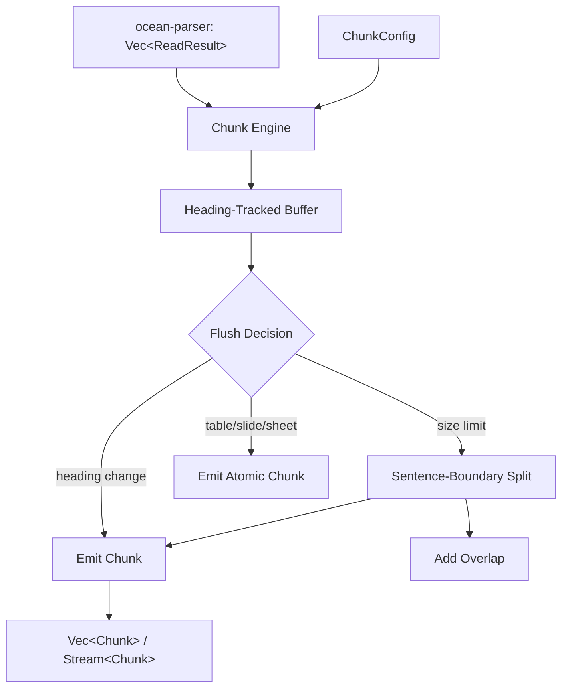

# Design Document: ocean-chunk — Semantic Chunk Engine

## Overview

This design introduces the **semantic chunk engine (ocean-chunk)** — the layer that converts parsed document blocks into searchable, self-contained knowledge units. The chunker sits between `ocean-parser` (which produces `ReadResult` blocks) and the vector/graph indexing layers (which consume `Chunk` values). The core algorithm is a **3-level grouping strategy**: structural grouping by headings, semantic merging of adjacent content under the same context, and size-constraint enforcement with sentence-boundary-aware splitting.

### Key Design Decisions

- **Heading-driven segmentation**: Headings are the primary chunk boundary. This is the most semantically meaningful split point and aligns with how humans organize documents.
- **Buffer-and-flush model**: A simple accumulator pattern — collect text blocks under the same heading, flush when a boundary or size limit is hit. Predictable, testable, and trivially adaptable to streaming.
- **Atomic block preservation**: Tables, slides, sheets, and images are never split. Structural integrity of these types is more important than size uniformity.
- **Overlap strategy for overflow splits**: When a single text block exceeds max size, split at sentence boundaries and overlap by 1–2 sentences. This prevents information loss at split boundaries while keeping chunks self-contained.
- **Token estimation via character ratio**: Using `len / 4` avoids external tokenizer dependencies while being adequate for size-limit enforcement. Configurable for custom estimators.

---

## Architecture



**Data flow**: `Vec<ReadResult>` enters the chunker. The chunker iterates in document order, maintaining a heading context and a content buffer. On each block, it decides: flush the buffer (heading change, table boundary, size limit) or append to buffer. Tables, slides, sheets, and images are emitted atomically. The output is a flat `Vec<Chunk>` (or stream) preserving document order.

---

## Components and Interfaces

### 1. Chunk Struct

```rust
pub struct Chunk {
    pub id: String,
    pub file_id: String,
    pub content: String,
    pub heading: Option<String>,
    pub page: Option<u32>,
    pub slide: Option<u32>,
    pub sheet: Option<String>,
    pub block_type: ChunkType,
    pub start_offset: Option<usize>,
    pub end_offset: Option<usize>,
}

pub enum ChunkType {
    Text,
    Table,
    Page,
    Slide,
    Sheet,
    Cell,
    Image,
    Metadata,
    Heading,
}
```

### 2. ChunkConfig

```rust
pub struct ChunkConfig {
    pub min_tokens: usize,
    pub max_tokens: usize,
    pub overlap_sentences: usize,
    pub include_images: bool,
    pub rows_per_sheet_chunk: usize,
    pub token_estimator: Option<fn(&str) -> usize>,
}

impl Default for ChunkConfig {
    fn default() -> Self {
        Self {
            min_tokens: 100,
            max_tokens: 800,
            overlap_sentences: 1,
            include_images: false,
            rows_per_sheet_chunk: 50,
            token_estimator: None,
        }
    }
}
```

### 3. ChunkError

```rust
pub enum ChunkError {
    EmptyInput,
    InvalidConfig(String),
    ContentTooLarge(String),
}

impl std::fmt::Display for ChunkError { /* ... */ }
impl std::error::Error for ChunkError { /* ... */ }
```

### 4. Core Chunking Functions

```rust
/// Batch chunk: process all blocks in memory
pub fn chunk(
    blocks: Vec<ReadResult>,
    file_id: &str,
    config: Option<ChunkConfig>,
) -> Result<Vec<Chunk>, ChunkError>;

/// Streaming chunk: process blocks as an iterator
pub fn chunk_stream(
    blocks: impl Iterator<Item = ReadResult>,
    file_id: &str,
    config: Option<ChunkConfig>,
) -> impl Iterator<Item = Result<Chunk, ChunkError>>;

/// Estimate token count (default: len / 4)
pub fn estimate_tokens(text: &str) -> usize;
```

### 5. Internal: ChunkBuffer

```rust
struct ChunkBuffer {
    content: String,
    heading: Option<String>,
    page: Option<u32>,
    slide: Option<u32>,
    sheet: Option<String>,
    block_type: ChunkType,
    start_offset: Option<usize>,
    char_count: usize,
}

impl ChunkBuffer {
    fn new() -> Self;
    fn append(&mut self, text: &str, block_type: ChunkType);
    fn is_empty(&self) -> bool;
    fn estimate_token_count(&self, estimator: &Option<fn(&str) -> usize>) -> usize;
    fn flush(&mut self, file_id: &str, config: &ChunkConfig) -> Vec<Chunk>;
    fn reset(&mut self);
}
```

---

## Chunking Algorithm (Detailed)

### Step 1 — Iterate Blocks in Document Order

```
for block in blocks:
    match block:
        ReadResult::Text(text) | ReadResult::Page { text, .. } →
            if is_heading(text):
                flush buffer
                emit Heading chunk
                update heading context
            else:
                append text to buffer
                if buffer exceeds max_tokens:
                    flush buffer (with sentence-boundary split)

        ReadResult::Table { .. } →
            flush buffer
            emit atomic Table chunk

        ReadResult::Slide { content, .. } →
            flush buffer
            emit atomic Slide chunk (or split by para if oversize)

        ReadResult::Sheet { rows, .. } →
            flush buffer
            emit atomic Sheet chunk (or split by row-group)

        ReadResult::Image { caption, .. } →
            if config.include_images:
                flush buffer
                emit atomic Image chunk (metadata only)

        ReadResult::CellValue(_) | ReadResult::MatchResult(_) →
            append text to buffer (contextual content)

        ReadResult::Metadata(_) | ReadResult::Outline(_) →
            skip (not chunkable)
```

### Step 2 — Sentence-Boundary Split (Oversize Handling)

When a single text block exceeds `max_tokens`:
1. Find the last sentence boundary (`.`, `!`, `?`, `\n\n`) within the limit.
2. Split at that boundary.
3. Emit the first segment as a chunk.
4. Prepend `overlap_sentences` sentences from the end of the first segment to the start of the next.
5. Continue until all text is chunked.

### Step 3 — Flush Remaining Buffer

After all blocks are processed, flush any remaining buffer content (if non-empty and above `min_tokens`).

### Step 4 — Post-Processing

- Merge adjacent chunks that are both below `min_tokens` and share the same heading.
- Drop chunks below `min_tokens` if no merge partner exists (orphan fragments).

---

## Data Models

### Chunk

| Field | Type | Description |
|-------|------|-------------|
| `id` | `String` | UUIDv7 unique identifier |
| `file_id` | `String` | Source file identity from ocean-fs |
| `content` | `String` | Textual content of the chunk |
| `heading` | `Option<String>` | Nearest preceding heading text |
| `page` | `Option<u32>` | Page number (PDF, DOCX) |
| `slide` | `Option<u32>` | Slide number (PPTX) |
| `sheet` | `Option<String>` | Sheet name (XLSX) |
| `block_type` | `ChunkType` | Variant identifying original block category |
| `start_offset` | `Option<usize>` | Character offset in original content |
| `end_offset` | `Option<usize>` | Character offset in original content |

### ChunkConfig

| Field | Type | Default | Description |
|-------|------|---------|-------------|
| `min_tokens` | `usize` | 100 | Minimum tokens per chunk |
| `max_tokens` | `usize` | 800 | Maximum tokens per chunk |
| `overlap_sentences` | `usize` | 1 | Sentences of overlap on overflow split |
| `include_images` | `bool` | false | Whether to include image blocks |
| `rows_per_sheet_chunk` | `usize` | 50 | Max rows per sheet chunk before splitting |
| `token_estimator` | `Option<fn(&str) -> usize>` | `None` | Custom token estimation function |

### ReadResult → ChunkType Mapping

| ReadResult Variant | ChunkType | Atomic? | Notes |
|--------------------|-----------|---------|-------|
| `Text(s)` | `Text` | No | Merged with adjacent text under same heading |
| `Table { .. }` | `Table` | Yes | Never split |
| `Image { .. }` | `Image` | Yes | Skipped by default; metadata only |
| `Metadata(_)` | `Metadata` | Yes | Not typically chunked |
| `Outline(_)` | — | — | Skipped (structural metadata) |
| `Page { .. }` | `Page` | Semi | Can be split if oversize |
| `Slide { .. }` | `Slide` | Yes | Can be split by paragraph if oversize |
| `Sheet { .. }` | `Sheet` | Semi | Split by row-group if oversize |
| `CellValue(s)` | `Cell` | No | Merged into parent context |
| `MatchResult(_)` | `Text` | No | Merged into parent context |

---

## Correctness Properties

### Property 1: No Heading Crossing

*For any* chunk in the output, all content within the chunk SHALL belong to the same heading (or no heading) context. No chunk SHALL contain content from two different headings.

**Validates:** R3

### Property 2: Table Integrity

*For any* `ReadResult::Table` in the input, there SHALL exist exactly one corresponding `Chunk` with `block_type: ChunkType::Table` in the output, and its `content` SHALL contain the full table data.

**Validates:** R4

### Property 3: Size Bound

*For any* chunk in the output, the estimated token count of its `content` SHALL be <= `max_tokens` (except for atomic types that cannot be split — tables, images — where a warning SHALL be issued instead).

**Validates:** R5

### Property 4: Deterministic Output

*For any* fixed `Vec<ReadResult>` input and fixed `ChunkConfig`, calling `chunk()` twice SHALL produce the same number of chunks with the same `content`, `heading`, `block_type`, and ordering (IDs MAY differ).

**Validates:** R8

### Property 5: No Mid-Sentence Split

*For any* chunk resulting from an overflow split, the split point SHALL fall on a sentence boundary (`.`, `!`, `?`, `\n\n`) — never mid-sentence.

**Validates:** R5.6

### Property 6: Streaming Equivalence

*For any* input `Vec<ReadResult>`, the output of `chunk_stream(blocks.into_iter(), ...)` SHALL be computationally equivalent to `chunk(blocks, ...)` — same count, same content, same ordering.

**Validates:** R14

### Property 7: Minimum Size Enforcement

*For any* chunk in the output with `block_type: ChunkType::Text`, the estimated token count SHALL be >= `min_tokens`, except when the remaining buffer after the last block is below `min_tokens` and no merge partner exists.

**Validates:** R5, R9.4

---

## Error Handling

| Scenario | Behaviour |
|----------|-----------|
| Empty input blocks | Return `Err(ChunkError::EmptyInput)` |
| `min_tokens > max_tokens` in config | Return `Err(ChunkError::InvalidConfig)` describing the conflict |
| Single text block exceeds max and has no sentence boundary | Split at hard limit — emit warning but still chunk |
| Corrupted or unparseable ReadResult | Not possible — ocean-parser guarantees valid ReadResult values |
| Image block when `include_images: false` | Silently skip — not an error |
| Metadata blocks | Silently skip — not an error |

---

## Testing Strategy

### Unit Tests

- **Heading boundary detection**: Content starting with `# `, `## `, etc. triggers flush
- **Buffer flush correctness**: Verify buffer content matches expected chunk after flush
- **Sentence-boundary split**: Verify split at `.`, `!`, `?`, `\n\n`; verify no mid-sentence split
- **Overlap generation**: Verify overlap sentences correctly prepended to subsequent chunk
- **Table atomicity**: Table block produces exactly 1 `ChunkType::Table` chunk
- **Slide handling**: Each slide produces exactly 1 chunk (or N if oversize)
- **Sheet row-group split**: Sheet with 200 rows and 50 rows/chunk produces 4 chunks
- **Token estimation**: Verify `len / 4` behavior with various input strings
- **Empty input**: Returns `Err(ChunkError::EmptyInput)`
- **Config validation**: `min > max` returns error
- **Determinism**: Same input + same config always produces same output

### Property-Based Tests

- Property 1 (No Heading Crossing): Generate random block sequences with headings, verify no chunk crosses heading boundary
- Property 3 (Size Bound): Generate random text blocks with varying sizes, verify all chunks within bounds
- Property 4 (Deterministic Output): Same input chunked 100 times, verify identical content output
- Property 5 (No Mid-Sentence Split): Generate blocks with sentence-boundary patterns, verify split points

### Integration Tests

- End-to-end: parse a real document → chunk → verify chunks are self-contained and ordered
- Chunk + vector index: verify chunks are embeddable
- Chunk + graph index: verify chunks carry sufficient context for graph building
- Large document (1000+ blocks) chunking performance benchmark
- Streaming vs batch equivalence test
