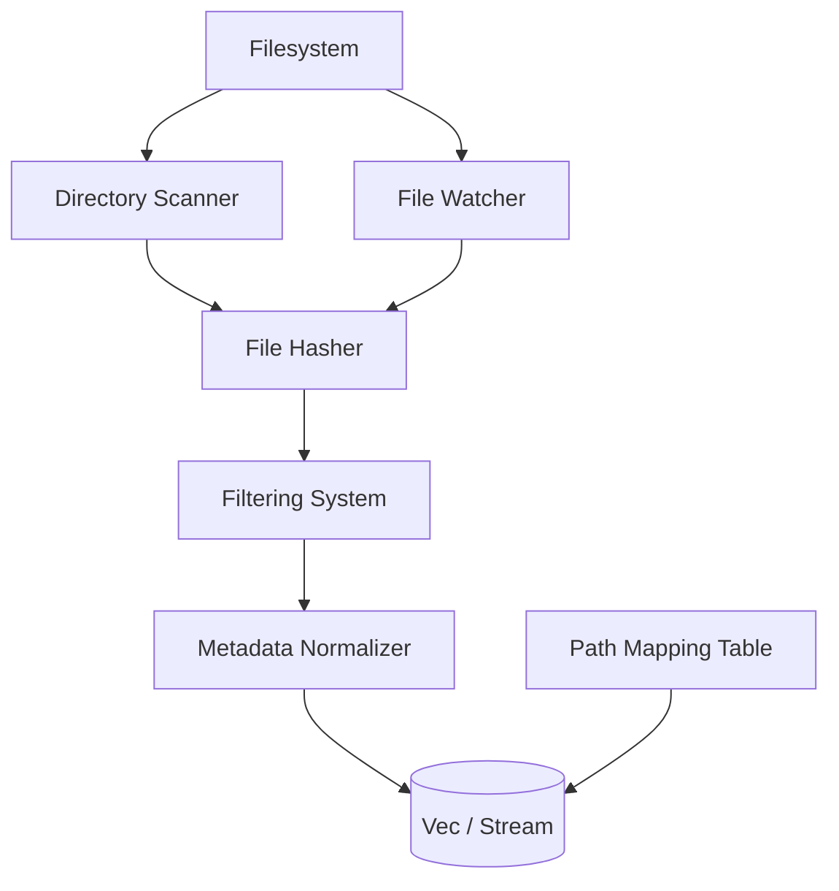

# Design Document: ocean-fs — Filesystem Layer

## Overview

This design introduces the **filesystem layer (ocean-fs)** — the ground truth ingestion layer of Ocean. It is responsible for discovering files, computing content fingerprints, detecting changes in real time, and producing a normalized, deduplicated, change-aware stream of file metadata. The design prioritizes **determinism**, **incrementality**, and **traceability** while maintaining zero awareness of file content semantics.

### Key Design Decisions

- **UUIDv7 for FileId**: Decouples identity from filesystem location, enabling file moves without identity breakage. Chosen over hash-based IDs for simplicity and flexibility.
- **Streaming SHA-256**: Never loads full file content into memory. Critical for handling large PDFs (100MB+) without exhausting RAM.
- **Event batching in file watcher**: Prevents reindex storms by coalescing rapid filesystem events (100 changes → 1 batch update).
- **Separate path mapping table**: Tracks file moves as first-class events rather than treating them as delete+create, preserving graph integrity.

---

## Architecture



**Data flow**: The filesystem is read via both one-shot scan (full reindex) and continuous watch (incremental updates). Each discovered file is hashed, filtered against the ignore list and supported formats, normalized into `NormalizedFile`, and emitted as output. The path mapping table tracks renames/moves separately.

---

## Components and Interfaces

### 1. Directory Scanner

Responsible for recursive directory traversal and initial file discovery.

```rust
pub trait FileScanner {
    /// Recursively scan a directory, returning all discovered file metadata
    fn scan_dir(path: &str) -> Vec<FileMeta>;

    /// Scan with optional filter callback for custom filtering
    fn scan_dir_filtered(path: &str, filter: Box<dyn Fn(&FileMeta) -> bool>) -> Vec<FileMeta>;
}
```

### 2. File Hasher

Responsible for content fingerprinting using streaming SHA-256.

```rust
pub trait FileHasher {
    /// Compute streaming SHA-256 hash of file at path
    fn hash_file(path: &str) -> Result<String, HashError>;

    /// Quick check if file hash matches expected value
    fn verify_hash(path: &str, expected: &str) -> bool;
}

pub enum HashError {
    IoError(std::io::Error),
    FileTooLarge(u64),
}
```

### 3. File Watcher

Responsible for real-time change detection on the filesystem.

```rust
pub enum FileEvent {
    Created(FileMeta),
    Modified(FileMeta),
    Deleted(FileId),
    Renamed { file_id: FileId, old_path: String, new_path: String },
    Moved { file_id: FileId, old_path: String, new_path: String },
}

pub trait FileWatcher {
    /// Watch a directory recursively, emitting events via callback
    fn watch(path: &str, callback: Box<dyn Fn(FileEvent)>) -> Result<WatchHandle, WatchError>;

    /// Stop watching
    fn unwatch(handle: WatchHandle) -> Result<(), WatchError>;
}

pub struct WatchHandle {
    pub id: String,
}
```

### 4. Path Resolution

Responsible for tracking file identity across moves and renames.

```rust
pub trait PathResolver {
    /// Record a file move in the mapping table
    fn record_move(&self, file_id: &str, old_path: &str, new_path: &str) -> Result<(), ResolverError>;

    /// Resolve the current path for a file_id
    fn resolve_path(&self, file_id: &str) -> Option<String>;

    /// Get the move history for a file
    fn get_move_history(&self, file_id: &str) -> Vec<PathMove>;
}

pub struct PathMove {
    pub file_id: String,
    pub old_path: String,
    pub new_path: String,
    pub timestamp: u64,
}
```

### 5. Metadata Normalizer

Responsible for producing format-independent metadata.

```rust
pub enum FileCategory {
    Document,
    Spreadsheet,
    Presentation,
    Image,
    Text,
    Unknown,
}

pub struct NormalizedFile {
    pub id: FileId,
    pub meta: FileMeta,
    pub mime_type: String,
    pub category: FileCategory,
}

pub trait MetadataNormalizer {
    fn normalize(meta: FileMeta) -> NormalizedFile;
}
```

---

## Data Models

### FileMeta

| Field | Type | Description |
|-------|------|-------------|
| `id` | `String` | UUIDv7 stable file identity |
| `path` | `String` | Current absolute path on disk |
| `hash` | `String` | Hex-encoded SHA-256 content fingerprint |
| `size` | `u64` | File size in bytes |
| `modified` | `u64` | Last modification timestamp (Unix ms) |
| `extension` | `String` | File extension without dot (e.g., "pdf") |

### FileEvent

| Variant | Payload | Description |
|---------|---------|-------------|
| `Created` | `FileMeta` | New file appeared |
| `Modified` | `FileMeta` | Existing file changed |
| `Deleted` | `FileId` | File removed |
| `Renamed` | `file_id`, `old_path`, `new_path` | File renamed in place |
| `Moved` | `file_id`, `old_path`, `new_path` | File relocated to different directory |

### FileCategory

| Variant | Extension Mapping |
|---------|-------------------|
| `Document` | pdf, docx |
| `Spreadsheet` | xlsx |
| `Presentation` | pptx |
| `Image` | png, jpg |
| `Text` | txt, md, html |
| `Unknown` | everything else |

### Path Mapping Table (SQLite schema)

```sql
CREATE TABLE file_paths (
    file_id TEXT NOT NULL,
    old_path TEXT NOT NULL,
    new_path TEXT NOT NULL,
    timestamp INTEGER NOT NULL
);

CREATE INDEX idx_file_paths_id ON file_paths(file_id);
```

---

## Correctness Properties

### Property 1: Deterministic Scan

*For any* fixed directory tree, calling `scan_dir` twice with the same input SHALL produce the same set of `FileMeta` values (order may differ).

**Validates:** R9.5

### Property 2: Identity Stability

*For any* file that is moved from path A to path B without content changes, its `FileId` SHALL remain unchanged and its hash SHALL remain the same.

**Validates:** R1.4

### Property 3: No Full File Load

*For any* file up to 4GB in size, the hashing function SHALL use at most 64KB of buffer memory at any time.

**Validates:** R3.2

### Property 4: Eventual Consistency

*For any* sequence of filesystem modifications, after all events are processed, the set of indexed files SHALL match the actual filesystem contents.

**Validates:** R4

### Property 5: Change Detection Soundness

*For any* file, if `hash_file` returns hash A and later returns hash B where A ≠ B, the file content SHALL differ.

**Validates:** R3.4

---

## Error Handling

| Scenario | Behaviour |
|----------|-----------|
| Permission denied on file | Skip file, log warning, continue scan |
| Symlink loop in directory | Detect cycle, skip link, log warning |
| File deleted before hashing | Return `HashError::IoError`, skip file |
| Unsupported file format | Categorize as `Unknown`, skip indexing, do not error |
| Binary file treated as text | Hash still computed correctly; downstream parser will reject |
| Watch buffer overflow | Re-scan entire watched directory, log overflow event |
| Invalid root path | Return `ScanError::InvalidPath` with descriptive message |

---

## Testing Strategy

### Unit Tests

- Scanner with empty directory, nested directories, hidden files, symlink loops
- Hasher with empty file, large file (multi-GB via sparse file), binary file, text file
- Watcher event emission for create/modify/delete/rename/move
- Normalizer category mapping for every supported extension
- Filtering logic with default and custom ignore patterns
- Path mapping table insert, query, and history retrieval

### Property-Based Tests

- Property 1 (Deterministic Scan): Scan random directory trees (100 iterations)
- Property 2 (Identity Stability): Random file renames + verify identity (100 iterations)
- Property 3 (No Full File Load): Verify buffer size during hash of random-sized files (100 iterations)
- Property 5 (Change Detection): Random content mutations + verify hash changes (100 iterations)

### Integration Tests

- End-to-end: scan → hash → filter → normalize → output stream
- Watcher + scanner consistency: modify files via watcher, verify full scan matches
- Path mapping across multiple move operations
- 10,000 file scan performance benchmark
