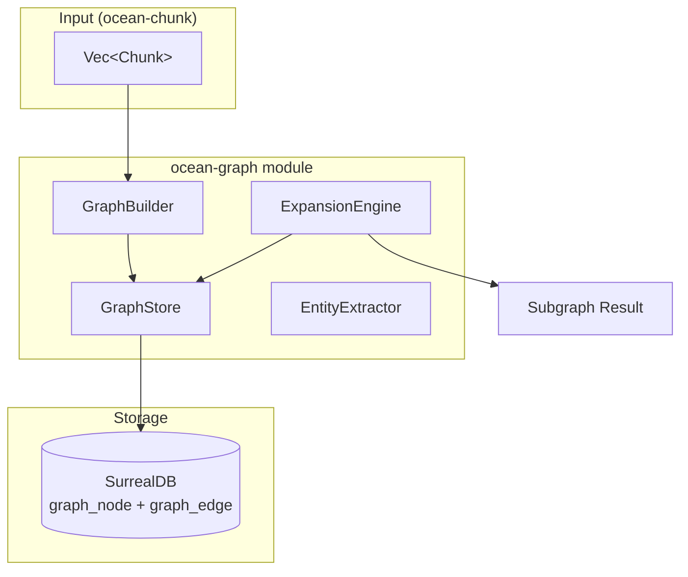

# Design Document: ocean-graph

## Overview

ocean-graph is the structural relationship layer. It takes chunks from ocean-chunk and builds a directed, typed knowledge graph storing nodes and edges in SurrealDB. The graph captures document hierarchy (file → chunk → heading), cross-document references, and entity mentions. It powers context expansion — taking vector search results and enriching them with structurally related chunks.

### Key Design Decisions

- **Decision 1 — SurrealDB nodes+edges tables**: Rather than using SurrealDB's graph-specific features (which are still maturing), we use two plain SCHEMAFULL tables (`graph_node`, `graph_edge`) with indexed `from_id`/`to_id` fields for fast neighbor lookups. This gives us full control over the schema, keeps the pattern identical to `ocean_vector::store`, and is portable to any relational backend.

- **Decision 2 — Graph built AFTER vector index**: The pipeline is chunk → embed → store vectors → build graph. Graph building does NOT depend on embeddings, only on chunk metadata and text content. This allows graph construction even without an embedder.

- **Decision 3 — Structural edges first, heuristic extraction second**: The graph builder separates structural edges (from chunk metadata — these are always correct) from reference/entity edges (from text heuristics — these are best-effort). Users can disable extraction via `GraphConfig` if they only want structural relationships.

- **Decision 4 — Separate GraphBuilder and ExpansionEngine**: `GraphBuilder` is a pure function: chunks → nodes + edges. `ExpansionEngine` is a store-backed traversal engine. This separation means the builder runs at index time, while the expansion engine queries the persisted graph at query time.

- **Decision 5 — Stable deterministic node IDs**: Node IDs follow the pattern `file:<file_id>`, `chunk:<chunk_id>`, `heading:<file_id>:<sha256(heading_text)>` so that rebuilding the same data produces identical graph state. This enables idempotent reindexing.

---

## Architecture



### Data Flow

```
Indexing:
  Vec<Chunk>  ──→  GraphBuilder.from_chunks()  ──→  GraphStore.insert_nodes_batch()
                                                        │
                                                        ↓
                                                   GraphStore.insert_edges_batch()
                                                        │
                                                        ↓
                                                   SurrealDB (graph_node + graph_edge tables)

Query / Expansion:
  seed node_id  ──→  ExpansionEngine.expand()  ──→  GraphStore.get_neighbors()  ──→  Subgraph
                        │                                 │
                        ↓                                 ↓
                   BFS/DFS traversal            SurrealDB indexed queries
```

---

## Components and Interfaces

### 1. Data Types (`types.rs`)

```rust
#[derive(Debug, Clone, PartialEq, Serialize, Deserialize)]
pub enum NodeType {
    File,
    Chunk,
    Heading,
    Entity,
    Folder,
}

#[derive(Debug, Clone, PartialEq, Serialize, Deserialize)]
pub enum RelationType {
    Contains,
    References,
    Mentions,
    BelongsTo,
    DerivedFrom,
    SimilarTo,
    CrossReference,
}

#[derive(Debug, Clone, PartialEq, Serialize, Deserialize)]
pub struct Node {
    pub id: String,
    pub node_type: NodeType,
    pub ref_id: String,
    pub label: Option<String>,
}

#[derive(Debug, Clone, PartialEq, Serialize, Deserialize)]
pub struct Edge {
    pub from: String,
    pub to: String,
    pub relation: RelationType,
    pub weight: f32,
    pub metadata: Option<String>,
}

#[derive(Debug, Clone)]
pub struct Subgraph {
    pub seed_id: String,
    pub nodes: Vec<Node>,
    pub edges: Vec<Edge>,
    pub depth: usize,
}
```

### 2. GraphConfig (`types.rs`)

```rust
#[derive(Debug, Clone)]
pub struct GraphConfig {
    pub extract_references: bool,
    pub extract_entities: bool,
    pub max_expansion_depth: usize,
    pub entity_min_frequency: usize,
    pub default_edge_weight: f32,
}

impl Default for GraphConfig {
    fn default() -> Self {
        Self {
            extract_references: true,
            extract_entities: true,
            max_expansion_depth: 3,
            entity_min_frequency: 3,
            default_edge_weight: 1.0,
        }
    }
}
```

### 3. GraphStore (`store.rs`)

SurrealDB-backed persistence for nodes and edges. Follows the exact same pattern as `ocean_vector::store::VectorStore` (sync-to-async bridge via `tokio::runtime::Runtime`).

```rust
pub struct GraphStore {
    db: Surreal<Db>,
    rt: Runtime,
}

impl GraphStore {
    pub fn new_memory() -> Result<Self, GraphError>;
    pub fn new_persistent(path: &str) -> Result<Self, GraphError>;
    pub fn initialize_schema(&self) -> Result<(), GraphError>;

    pub fn insert_node(&self, node: Node) -> Result<(), GraphError>;
    pub fn insert_edge(&self, edge: Edge) -> Result<(), GraphError>;
    pub fn insert_nodes_batch(&self, nodes: Vec<Node>) -> Result<(), GraphError>;
    pub fn insert_edges_batch(&self, edges: Vec<Edge>) -> Result<(), GraphError>;

    pub fn get_node(&self, id: &str) -> Result<Option<Node>, GraphError>;
    pub fn get_edge_by_id(&self, id: &str) -> Result<Option<Edge>, GraphError>;
    pub fn get_node_by_ref(&self, ref_id: &str) -> Result<Option<Node>, GraphError>;

    pub fn get_neighbors(&self, node_id: &str) -> Result<Vec<(Node, Edge)>, GraphError>;
    pub fn get_edges(&self, node_id: &str, direction: EdgeDirection) -> Result<Vec<Edge>, GraphError>;
    pub fn get_nodes_by_type(&self, node_type: NodeType) -> Result<Vec<Node>, GraphError>;
    pub fn get_edges_by_relation(&self, relation: RelationType) -> Result<Vec<Edge>, GraphError>;

    pub fn delete_nodes_by_file(&self, file_id: &str) -> Result<u64, GraphError>;
    pub fn delete_edges_by_file(&self, file_id: &str) -> Result<u64, GraphError>;

    pub fn count_nodes(&self) -> Result<u64, GraphError>;
    pub fn count_edges(&self) -> Result<u64, GraphError>;
    pub fn clear(&self) -> Result<(), GraphError>;
}

pub enum EdgeDirection {
    Forward,
    Backward,
    Both,
}
```

### 4. GraphBuilder (`builder.rs`)

Pure function that transforms chunks into graph nodes and edges.

```rust
pub struct GraphBuilder;

impl GraphBuilder {
    pub fn from_chunks(chunks: &[Chunk], file_id: &str, config: &GraphConfig) -> (Vec<Node>, Vec<Edge>);

    pub fn structural(chunks: &[Chunk], file_id: &str) -> (Vec<Node>, Vec<Edge>);
    pub fn extract_references(chunks: &[Chunk], nodes: &[Node]) -> Vec<Edge>;
    pub fn extract_entities(chunks: &[Chunk], config: &GraphConfig) -> (Vec<Node>, Vec<Edge>);
}
```

### 5. EntityExtractor (`entity.rs`)

Heuristic entity extraction from chunk text.

```rust
pub struct EntityExtractor;

impl EntityExtractor {
    pub fn extract(text: &str, min_frequency: usize) -> Vec<String>;
    pub fn extract_capitalized(text: &str) -> Vec<String>;
    pub fn extract_repeated(content_by_chunk: &[(String, &str)], min_freq: usize) -> Vec<String>;
}
```

### 6. ExpansionEngine (`expansion.rs`)

Traverses the persisted graph to discover connected subgraphs.

```rust
pub struct ExpansionEngine {
    store: GraphStore,
}

impl ExpansionEngine {
    pub fn new(store: GraphStore) -> Self;

    pub fn expand(&self, node_id: &str, depth: usize, direction: EdgeDirection) -> Result<Subgraph, GraphError>;
    pub fn expand_from_chunks(&self, chunk_ids: &[String], depth: usize) -> Result<Subgraph, GraphError>;
    pub fn find_path(&self, from_id: &str, to_id: &str, max_depth: usize) -> Result<Option<Vec<Edge>>, GraphError>;
    pub fn get_file_graph(&self, file_id: &str) -> Result<Subgraph, GraphError>;
}
```

### 7. GraphError (`error.rs`)

```rust
#[derive(Debug, Clone)]
pub enum GraphError {
    StoreError(String),
    NodeNotFound(String),
    EdgeNotFound(String),
    InvalidDepth(String),
    CycleDetected,
    SerializationError(String),
}
```

---

## SurrealDB Schema

```surql
-- Graph nodes table
DEFINE TABLE graph_node SCHEMAFULL;

DEFINE FIELD IF NOT EXISTS id ON TABLE graph_node TYPE string;
DEFINE FIELD IF NOT EXISTS node_type ON TABLE graph_node TYPE string;
DEFINE FIELD IF NOT EXISTS ref_id ON TABLE graph_node TYPE string;
DEFINE FIELD IF NOT EXISTS label ON TABLE graph_node TYPE option<string>;
DEFINE FIELD IF NOT EXISTS file_id ON TABLE graph_node TYPE string;
DEFINE FIELD IF NOT EXISTS created_at ON TABLE graph_node TYPE int;

DEFINE INDEX IF NOT EXISTS idx_node_id ON TABLE graph_node FIELDS id UNIQUE;
DEFINE INDEX IF NOT EXISTS idx_node_ref ON TABLE graph_node FIELDS ref_id;
DEFINE INDEX IF NOT EXISTS idx_node_type ON TABLE graph_node FIELDS node_type;
DEFINE INDEX IF NOT EXISTS idx_node_file ON TABLE graph_node FIELDS file_id;

-- Graph edges table
DEFINE TABLE graph_edge SCHEMAFULL;

DEFINE FIELD IF NOT EXISTS id ON TABLE graph_edge TYPE string;
DEFINE FIELD IF NOT EXISTS from_id ON TABLE graph_edge TYPE string;
DEFINE FIELD IF NOT EXISTS to_id ON TABLE graph_edge TYPE string;
DEFINE FIELD IF NOT EXISTS relation ON TABLE graph_edge TYPE string;
DEFINE FIELD IF NOT EXISTS weight ON TABLE graph_edge TYPE float;
DEFINE FIELD IF NOT EXISTS metadata ON TABLE graph_edge TYPE option<string>;
DEFINE FIELD IF NOT EXISTS file_id ON TABLE graph_edge TYPE string;
DEFINE FIELD IF NOT EXISTS created_at ON TABLE graph_edge TYPE int;

DEFINE INDEX IF NOT EXISTS idx_edge_id ON TABLE graph_edge FIELDS id UNIQUE;
DEFINE INDEX IF NOT EXISTS idx_edge_from ON TABLE graph_edge FIELDS from_id;
DEFINE INDEX IF NOT EXISTS idx_edge_to ON TABLE graph_edge FIELDS to_id;
DEFINE INDEX IF NOT EXISTS idx_edge_relation ON TABLE graph_edge FIELDS relation;
DEFINE INDEX IF NOT EXISTS idx_edge_file ON TABLE graph_edge FIELDS file_id;
```

---

## Node ID Convention

Stable, deterministic IDs for idempotent reindexing:

| Node Type | ID Pattern | Example |
|-----------|-----------|---------|
| File | `file:<file_id>` | `file:"0189abcd-..."` |
| Chunk | `chunk:<chunk_id>` | `chunk:"0189abc-..."` |
| Heading | `heading:<file_id>:<sha256(text)>` | `heading:"0189abcd-...:a1b2c3..."` |
| Entity | `entity:<sha256(name)>` | `entity:"d4e5f6..."` |

---

## Graph Builder Algorithm

### Step-by-step: `from_chunks(chunks, file_id, config)`

```
1. Create File node: Node { id: "file:<file_id>", node_type: File, ref_id: file_id, label: None }
2. For each chunk:
   a. Create Chunk node: Node { id: "chunk:<chunk_id>", node_type: Chunk, ref_id: chunk.id, label: None }
   b. Create edge: File ─Contains─→ Chunk
   c. Create edge: Chunk ─BelongsTo─→ File
   d. If chunk has heading:
      i.   Compute heading_id = "heading:<file_id>:<sha256(heading)>"
      ii.  Create/get Heading node: Node { id: heading_id, node_type: Heading, ... }
      iii. Create edge: Chunk ─BelongsTo─→ Heading
3. If config.extract_references:
   - Scan each chunk's content for "see <X>", "refer to <X>", URLs, quoted titles
   - Create References edges from source chunk to best-guess target nodes
4. If config.extract_entities:
   - Extract capitalized phrases and repeated nouns
   - Create Entity nodes and Mentions edges from chunks to matching entities
5. Return (nodes, edges)
```

---

## Expansion Algorithm

### BFS traversal: `expand(node_id, depth, direction)`

```
1. Initialize: visited = {node_id}, result_nodes = [], result_edges = [], queue = [(node_id, 0)]
2. While queue not empty:
   (current_node, current_depth) = queue.pop_front()
   if current_depth == max_depth: continue
   neighbors = store.get_neighbors(current_node, direction)
   for (neighbor_node, edge) in neighbors:
       result_edges.push(edge)
       if neighbor_node.id not in visited:
           visited.insert(neighbor_node.id)
           result_nodes.push(neighbor_node)
           queue.push_back((neighbor_node.id, current_depth + 1))
3. Return Subgraph { seed_id: node_id, nodes: result_nodes, edges: result_edges, depth }
```

---

## SurrealQL Query Examples

### Get neighbors of a node

```surql
-- Outgoing edges
SELECT * FROM graph_edge WHERE from_id = $node_id;

-- Incoming edges
SELECT * FROM graph_edge WHERE to_id = $node_id;

-- Get nodes connected by outgoing edges
SELECT * FROM graph_node WHERE id IN (
    SELECT to_id FROM graph_edge WHERE from_id = $node_id
);

-- Get file subgraph
SELECT * FROM graph_node WHERE file_id = $file_id;
SELECT * FROM graph_edge WHERE file_id = $file_id;

-- Count by type
SELECT node_type, count() AS cnt FROM graph_node GROUP BY node_type;

-- Shortest path (via Rust BFS — SurrealDB does not support graph path queries natively)
```

---

## Correctness Properties

### Property 1: Structural Edge Completeness

*For any* chunk C with heading H in file F, the graph SHALL contain edges: `F → Contains → C`, `C → BelongsTo → F`, and (if H exists) `C → BelongsTo → H`.

**Validates:** R3

### Property 2: Stable Node Identity

*For any* set of chunks and fixed file_id, running `GraphBuilder::from_chunks` twice SHALL produce nodes and edges with identical IDs.

**Validates:** R3.6, R8.5

### Property 3: Expansion Boundedness

*For any* expansion with depth D from seed node N, the returned subgraph SHALL contain only nodes reachable within D hops, and SHALL NOT contain paths exceeding D edges from N.

**Validates:** R5

### Property 4: Delete Cascades Correctly

*For any* file_id F, after `delete_nodes_by_file(F)` and `delete_edges_by_file(F)`, the graph SHALL contain no nodes with `file_id = F` and no edges with `file_id = F`.

**Validates:** R2.7

### Property 5: Reference Edge Tolerance

*For any* chunk text containing a reference pattern, the graph SHALL create a `References` edge even if the target node does not exist in the graph.

**Validates:** R4.5

### Property 6: Deterministic Entity Extraction

*For any* fixed text input and fixed `GraphConfig`, `EntityExtractor::extract` SHALL return the same entity list regardless of invocation order or timing.

**Validates:** R4

### Property 7: Idempotent Reindex

*For any* file F indexed twice with the same chunks, the final graph state SHALL be identical to a single index run (no duplicate nodes or edges).

**Validates:** R8.3, R8.5

---

## Error Handling

| Scenario | Behaviour |
|----------|-----------|
| Node not found by ID | `GraphError::NodeNotFound` — includes the requested ID |
| Edge not found by ID | `GraphError::EdgeNotFound` — includes the requested ID |
| Invalid expansion depth (0 or >5) | `GraphError::InvalidDepth` — describes valid range |
| Cycle detected during traversal | `GraphError::CycleDetected` — expansion stops gracefully |
| SurrealDB connection fails | `GraphError::StoreError` — wraps underlying store error |
| SurrealDB query fails | `GraphError::StoreError` — includes SurrealDB error detail |
| Serialization error on edge weight | `GraphError::SerializationError` — includes field/value detail |

---

## Testing Strategy

### Unit Tests

- Node/Edge type creation, serialization roundtrip
- GraphConfig defaults
- `GraphBuilder::structural` produces correct nodes/edges for known chunk input
- `GraphBuilder::extract_references` detects known patterns
- `EntityExtractor::extract_capitalized` returns known phrases
- `EntityExtractor::extract_repeated` frequency threshold behavior
- Stable node ID generation (deterministic for same input)
- `GraphError` Display/Debug implementations

### Integration Tests (in-memory SurrealDB)

- GraphStore: full CRUD cycle (insert/get/delete/count)
- GraphStore: neighbors query returns correct edges in both directions
- GraphStore: node type counts
- GraphStore: batch insert + delete by file
- GraphBuilder + GraphStore: end-to-end build and verify
- ExpansionEngine: BFS produces correct-depth subgraph
- ExpansionEngine: deduplication (no duplicate nodes/edges in expansion)
- ExpansionEngine: `find_path` returns valid path between connected nodes
- Reindex idempotency: build twice, verify same state

### Property-Based Tests

- Structural edge property: for any Chunk, the appropriate Contains/BelongsTo edges exist
- Expansion boundedness: for any node and depth, all returned nodes are within depth D
- Node ID determinism: same inputs produce same IDs

---

## File Structure

```
src/ocean_graph/
├── mod.rs           — pub mod + pub use re-exports
├── types.rs         — Node, Edge, NodeType, RelationType, Subgraph, GraphConfig
├── store.rs         — GraphStore (SurrealDB-backed)
├── builder.rs       — GraphBuilder (chunks → nodes + edges)
├── entity.rs        — EntityExtractor (heuristic extraction)
├── expansion.rs     — ExpansionEngine (BFS/DFS traversal)
├── error.rs         — GraphError enum
├── store_test.rs    — GraphStore integration tests
├── builder_test.rs  — GraphBuilder unit tests
├── entity_test.rs   — EntityExtractor unit tests
└── expansion_test.rs — ExpansionEngine integration tests
```
