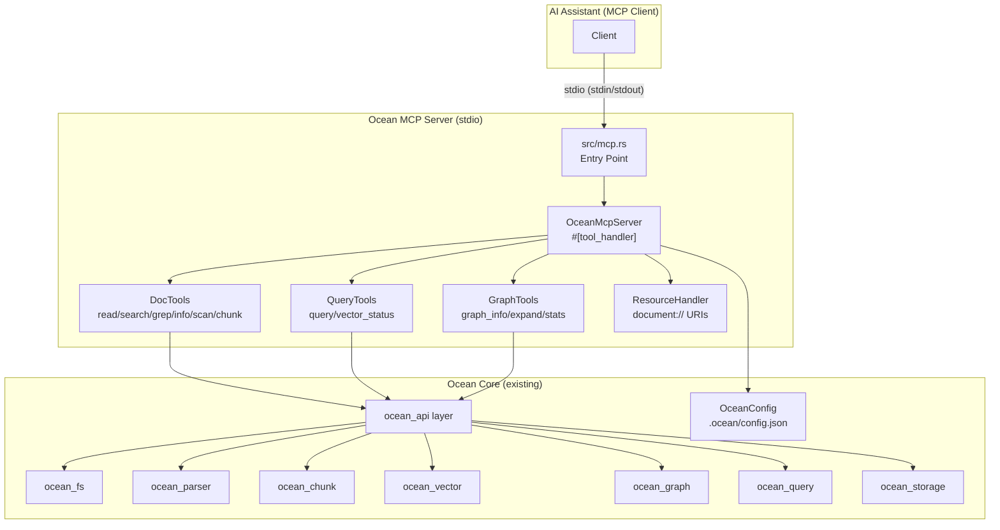

# Design Document: ocean-mcp

## Overview

ocean-mcp wraps Ocean's document intelligence pipeline — accessible today only via CLI — as a set of MCP tools served over stdio. An AI assistant connects to the server (spawned as a subprocess by the MCP client), discovers available tools via `list_tools`, invokes them via `call_tool`, and receives structured text results.

The design leverages the official `rmcp` Rust SDK (v2.0.0) for protocol handling, transport, and the `#[tool]`/`#[tool_handler]` macro system. Each tool is a thin async wrapper around the existing synchronous `ocean_api` functions, called via `tokio::task::spawn_blocking`. Config is loaded through the existing `OceanConfig` chain. No new business logic is introduced — this is a protocol adaptation layer.

### Key Design Decisions

- **Decision 1 — Same crate, new binary target**: Adding the MCP server as a `[[bin]]` target (`mcp`) within the existing `ocean-doc` crate avoids a new workspace member, shares all dependencies and modules directly, and follows the existing pattern (`ocean` + `cli` binaries). The marginal cost is one new module (`ocean_mcp/`) plus the entry point.

- **Decision 2 — `#[tool_handler]` macro pattern over manual `ServerHandler` impl**: `rmcp`'s `#[tool_handler]` attribute macro generates the `list_tools`, `get_tool`, and `call_tool` dispatch from annotated methods. This is the idiomatic approach — less boilerplate, automatic schema generation via `schemars`, and compile-time validation that all tools are handled.

- **Decision 3 — Stdio transport only (MVP)**: Stdio is the simplest and most portable MCP transport. Every MCP client supports it (Claude Desktop, Cursor, VS Code extensions). Streamable HTTP can be added later behind a feature flag.

- **Decision 4 — Sync → async bridge via `tokio::task::spawn_blocking`**: All `ocean_api` functions are synchronous (they use internal `tokio::Runtime` for SurrealDB calls). Each MCP tool handler is async (required by `rmcp`). Rather than refactoring the entire API layer, handlers call `spawn_blocking` to offload synchronous work to the blocking thread pool.

- **Decision 5 — `CallToolResult::error()` for user-facing failures**: Following `rmcp`'s guidance, tools return `Ok(CallToolResult::error(...))` for expected failures (file not found, no index), and reserve `Err(McpError)` for protocol violations. This ensures error messages reach the AI assistant's UI.

- **Decision 6 — Resource URIs with `document://` scheme**: MCP resources provide a second access path for document content. The `document://{encoded-path}` URI scheme allows AI assistants to fetch file content without calling a read tool. Only explicit `read_resource` requests are handled — no resource enumeration.

---

## Architecture



### Data Flow

```
Initialisation:
  OceanMcpServer::new()
    ├── load_env_files()          ← ~/.ocean/.env → ./.env → ./.ocean/.env
    ├── OceanConfig::load()       ← .ocean/config.json + ~/.ocean/config.json
    └── resolve embeddings config ← config → env → defaults

Tool invocation:
  Client → call_tool(name="read", args={file_path: "doc.pdf"})
    ├── ServerHandler::call_tool()
    │     └── #[tool_handler] dispatches to `read()` method
    ├── tokio::task::spawn_blocking(|| ocean_api::docs::read_doc(...))
    └── return CallToolResult::success(vec![Content::Text("...")])

Resource read:
  Client → read_resource(uri="document:///home/user/doc.pdf")
    ├── decode URI → file path
    ├── read file content
    └── return ReadResourceResult with text content
```

---

## Components and Interfaces

### 1. Binary Entry Point (`src/mcp.rs`)

Minimal entry point that calls `ocean_mcp::run()`, following the same pattern as `src/main.rs` → `ocean_cli::run()` and `src/cli.rs` → `ocean_cli::run()`.

```rust
fn main() {
    ocean::ocean_mcp::run();
}
```

### 2. Module Root (`src/ocean_mcp/mod.rs`)

Re-exports submodules and provides the public `run()` function.

```rust
pub mod tools;
pub mod server;
pub mod config;

pub fn run() {
    // 1. Load environment + config
    // 2. Create OceanMcpServer
    // 3. Start stdio transport
    // 4. Block until client disconnects
}
```

### 3. OceanMcpServer (`src/ocean_mcp/server.rs`)

The core struct that implements `ServerHandler` using the `#[tool_handler]` macro.

```rust
#[derive(Clone)]
pub struct OceanMcpServer {
    pub config: OceanConfig,
}

#[tool_handler]
impl OceanMcpServer {
    #[tool(name = "read", description = "Read content from any supported document...")]
    pub async fn read(&self, params: Parameters<ReadParams>) -> CallToolResult { ... }

    // ... 10 more tool methods
}
```

Tool methods follow this pattern:
```rust
async fn tool_name(&self, params: Parameters<T>) -> CallToolResult {
    let p = params.into_inner();
    // Option A: call sync ocean_api via spawn_blocking
    let result = tokio::task::spawn_blocking(move || {
        ocean_api::some_function(p.field1, p.field2)
    }).await.unwrap_or_else(|e| Err(ApiError::...))?;

    match result {
        Ok(output) => CallToolResult::success(vec![Content::Text(output.to_string())]),
        Err(e) => CallToolResult::error("Error", Some(e.to_string())),
    }
}
```

### 4. Tool Parameter Types (`src/ocean_mcp/tools/mod.rs`)

Each tool has a dedicated parameter struct with `schemars::JsonSchema` + `serde::Deserialize` derives. All types are defined in a single module for discoverability.

```rust
#[derive(JsonSchema, Deserialize)]
pub struct ReadParams {
    pub file_path: String,
    pub selector_type: Option<String>,
    pub selector_value: Option<String>,
    pub skip: Option<u32>,
    pub take: Option<u32>,
}

#[derive(JsonSchema, Deserialize)]
pub struct SearchParams {
    pub file_path: String,
    pub query: String,
}

#[derive(JsonSchema, Deserialize)]
pub struct GrepParams {
    pub directory: String,
    pub query: String,
}

#[derive(JsonSchema, Deserialize)]
pub struct InfoParams {
    pub file_path: String,
}

#[derive(JsonSchema, Deserialize)]
pub struct ScanParams {
    pub directory: String,
    pub include_hash: Option<bool>,
}

#[derive(JsonSchema, Deserialize)]
pub struct ChunkParams {
    pub file_path: String,
    pub min_size: Option<usize>,
    pub max_size: Option<usize>,
    pub overlap: Option<usize>,
}

#[derive(JsonSchema, Deserialize)]
pub struct QueryParams {
    pub query: String,
    pub mode: Option<String>,
    pub top_k: Option<usize>,
    pub expand_depth: Option<usize>,
    pub include_context: Option<bool>,
    pub db_path: Option<String>,
    pub provider: Option<String>,
    pub model: Option<String>,
    pub filter_file_id: Option<String>,
    pub filter_heading: Option<String>,
    pub filter_block_type: Option<String>,
}

#[derive(JsonSchema, Deserialize)]
pub struct VectorStatusParams {
    pub db_path: Option<String>,
    pub provider: Option<String>,
    pub model: Option<String>,
}

#[derive(JsonSchema, Deserialize)]
pub struct GraphInfoParams {
    pub file_path: String,
    pub db_path: Option<String>,
}

#[derive(JsonSchema, Deserialize)]
pub struct GraphExpandParams {
    pub node_id: String,
    pub depth: Option<usize>,
    pub direction: Option<String>,
    pub db_path: Option<String>,
}

#[derive(JsonSchema, Deserialize)]
pub struct GraphStatsParams {
    pub db_path: Option<String>,
}

#[derive(JsonSchema, Deserialize)]
pub struct VerifyParams {
    pub file_path: String,
    pub expected_hash: String,
}
```

### 5. Tool Implementations (`src/ocean_mcp/tools/doc_tools.rs`, `query_tools.rs`, `graph_tools.rs`)

Grouped into three files for organisation:

| File | Tools |
|------|-------|
| `doc_tools.rs` | `read`, `search`, `grep`, `info`, `scan`, `chunk`, `verify` |
| `query_tools.rs` | `query`, `vector_status` |
| `graph_tools.rs` | `graph_info`, `graph_expand`, `graph_stats` |

Each file contains free functions (not methods) that the server methods delegate to. This keeps the server struct thin and makes tool logic testable without MCP infrastructure.

```rust
// doc_tools.rs
pub async fn handle_read(params: ReadParams) -> CallToolResult { ... }
pub async fn handle_search(params: SearchParams) -> CallToolResult { ... }
// etc.
```

### 6. Config (`src/ocean_mcp/config.rs`)

Thin wrapper around `OceanConfig` for MCP-specific settings:

```rust
pub struct McpConfig {
    pub db_path: String,
    pub embedding_provider: String,
    pub embedding_model: String,
    pub embedding_dimension: usize,
    pub api_key: Option<String>,
    pub base_url: String,
}

impl McpConfig {
    pub fn from_ocean_config(config: &OceanConfig) -> Self { ... }
    pub fn resolve_db_path(cli: Option<&str>) -> String { ... }
}
```

### 7. Resource Handler (`src/ocean_mcp/resources.rs`)

Handles `document://` URI scheme for MCP resources:

```rust
impl OceanMcpServer {
    fn handle_document_resource(uri: &str) -> Result<ReadResourceResult, McpError> {
        // 1. Parse URI: "document:///path/to/file" → path = "/path/to/file"
        // 2. Validate file exists
        // 3. Read content via ocean_api
        // 4. Return ReadResourceResult { contents: vec![TextResourceContents { ... }] }
    }
}
```

---

## Data Models

### Tool Parameter Types (JSON Schema)

Each parameter struct generates its own JSON Schema via `schemars` at compile time. These schemas are returned as part of `Tool` definitions in `list_tools`. Example generated schema for `ReadParams`:

```json
{
  "type": "object",
  "properties": {
    "file_path": { "type": "string", "description": "Path to the document file" },
    "selector_type": {
      "type": "string",
      "enum": ["page", "heading", "paragraph", "table", "slide", "sheet", "cell", "range", "skip"],
      "description": "Type of selector"
    },
    "selector_value": { "type": "string" },
    "skip": { "type": "integer", "minimum": 0 },
    "take": { "type": "integer", "minimum": 1 }
  },
  "required": ["file_path"]
}
```

### ServerInfo

```rust
ServerInfo {
    name: "ocean-mcp".into(),
    version: env!("CARGO_PKG_VERSION").into(),
    // capabilities: tools + resources
}
```

### CallToolResult (output)

Every tool returns `CallToolResult::success(vec![Content::Text { text, annotations: None }])` on success, or `CallToolResult::error("Error", Some(detail))` on failure.

---

## Correctness Properties

### Property P1: Tool dispatch correctness

*For any* valid `call_tool` request with a known tool name, the handler SHALL dispatch to the correct implementation and return a `CallToolResult` (not an `Err(McpError)`).

**Validates:** R2.4, R2.5

### Property P2: Error isolation

*For any* `call_tool` request with an unknown tool name, the handler SHALL return `Err(McpError::method_not_found())`.

**Validates:** R14.2

### Property P3: File-not-found handling

*For any* tool that accepts a `file_path` parameter, IF the file does not exist, the handler SHALL return `CallToolResult::error(...)` with a message containing "not found".

**Validates:** R3.3, R14.1

### Property P4: No panic guarantee

*For any* input (valid, invalid, empty, malformed JSON), the handler SHALL NOT panic and SHALL return either `Ok(CallToolResult)` or `Err(McpError)`.

**Validates:** R14.4

### Property P5: Initialisation completes

*For any* valid environment, `OceanMcpServer::new()` SHALL succeed and produce a `ServerHandler`-compatible instance.

**Validates:** R13.1, R13.2

### Property P6: Resource URI parsing

*For any* `document://` URI with a valid file path, `handle_document_resource` SHALL find the file and return `ReadResourceResult`. IF the file does not exist, SHALL return `Err(McpError)` with `not_found` code.

**Validates:** R15.3, R15.5

---

## Error Handling

| Scenario | Behaviour |
|----------|-----------|
| File not found | Return `CallToolResult::error("File not found", Some("detail path"))` |
| Unsupported format | Return `CallToolResult::error("Unsupported format", Some("detail ext"))` |
| Database not initialised | Return `CallToolResult::error("Index not found", Some("Run 'ocean index .' first"))` |
| Embedder unreachable | Return `CallToolResult::error("Embedder unavailable", Some("detail"))` |
| Unknown tool name | Return `Err(McpError::method_not_found())` |
| Invalid JSON params | Return `Err(McpError::invalid_params())` |
| Unknown resource URI | Return `Err(McpError::resource_not_found())` |
| Internal panic | Catch via `std::panic::catch_unwind`, return `CallToolResult::error` |
| Config file parse error | Log warning to stderr, use defaults (don't fail startup) |

---

## Testing Strategy

### Unit Tests (`ocean_mcp/tools/doc_tools_test.rs`, etc.)

- Each tool handler function tested with valid params
- Each tool handler tested with missing/invalid params
- Error responses checked for expected message content
- Config loading from mock file paths
- Resource URI parsing (encode/decode round-trip)

### Integration Tests

- Start MCP server in-process with `rmcp::transport::io::stdio()` test harness
- Send `list_tools` request, verify 11 tool definitions returned
- Send `call_tool` for each tool with valid params, verify `CallToolResult::success`
- Send `call_tool` for each tool with invalid params, verify `CallToolResult::error`
- Send `call_tool` with unknown name, verify `Err(McpError)`
- Send `read_resource` with `document://` URI, verify content returned
- Full init/shutdown sequence

### Real-world test

- Build binary: `cargo build --bin mcp`
- Test with MCP Inspector: `npx @modelcontextprotocol/inspector target/debug/mcp.exe`
