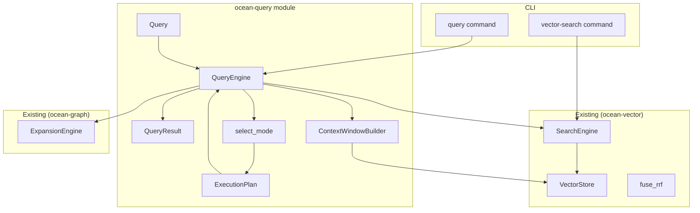

# Design Document: ocean-query

## Overview

ocean-query is the top-level query orchestrator. It delegates to existing sub-engines (`SearchEngine` for vector/FTS/hybrid, `ExpansionEngine` for graph traversal, `VectorStore` for chunk retrieval) rather than reimplementing them. The value it adds is: a unified `Query` → `QueryResult` contract, automatic mode selection, context window construction, execution timing, and a stable public API.

### Key Design Decisions

- **Decision 1 — Delegate, don't duplicate**: `QueryEngine` wraps `ocean_vector::search::SearchEngine`, `ocean_graph::expansion::ExpansionEngine`, and `ocean_vector::store::VectorStore`. It does NOT reimplement vector search, FTS, RRF fusion, or graph traversal. The existing `SearchEngine::expand_results()` and `fuse_rrf()` are called directly. This guarantees backwards compatibility and avoids code duplication.

- **Decision 2 — `QueryEngine` owns or borrows sub-engines**: `QueryEngine` is constructed with owned `VectorStore`, `SearchEngine`, and `ExpansionEngine` instances. These are constructed internally from a common `db_path` or passed in for testing. The `Runtime` for sync-to-async bridging is shared.

- **Decision 3 — ContextWindowBuilder uses VectorStore directly**: Context windows are built by querying the `VectorStore` chunk table for adjacent chunks in the same heading scope. No new storage schema is needed — the existing `chunk` table with `file_id` and `heading` fields supports adjacency queries.

- **Decision 4 — `auto` mode is a deterministic function**: `select_mode()` is a pure function with no I/O. It uses simple heuristics (word count, trigger phrases) to select the mode. This makes it trivially testable and predictable.

- **Decision 5 — ExecutionMeta is best-effort timing**: Timing is measured with `std::time::Instant` at each pipeline stage. Overhead is negligible. Times are returned in milliseconds as `u64`. This is diagnostic, not profiling-grade.

- **Decision 6 — No new storage dependencies**: The `chunk` table in SurrealDB (already created by `VectorStore::initialize_schema`) is sufficient for context window construction. No new tables or indexes are needed by ocean-query.

---

## Architecture



### Data Flow

```
User Input (text, mode, options)
    ↓
QueryEngine::query(query)
    ↓
1. select_mode(query) → QueryMode
2. Build ExecutionPlan
3. Execute sub-queries:
   a. embed query text (via SearchEngine.embedder)
   b. vector_search (via SearchEngine)
   c. fts_search (if hybrid, via SearchEngine)
   d. fuse_rrf (if hybrid, via fuse_rrf)
   e. graph_expand (if expand, via ExpansionEngine)
   f. rerank (if diversity options set)
4. Build context windows (if include_context)
5. Package QueryResult with ExecutionMeta
    ↓
Return QueryResult
```

---

## Components and Interfaces

### 1. QueryEngine

The central orchestrator. Owns sub-engines, executes queries.

```rust
pub struct QueryEngine {
    store: VectorStore,
    search: SearchEngine,
    graph: Option<ExpansionEngine>,
}

impl QueryEngine {
    /// Create with persistent SurrealDB at `db_path`.
    pub fn new(db_path: &str) -> Result<Self, QueryError>;

    /// Create with in-memory SurrealDB (for tests).
    pub fn new_memory() -> Result<Self, QueryError>;

    /// Execute a query and return structured results.
    pub fn query(&self, query: Query) -> Result<QueryResult, QueryError>;

    /// Execute a query and stream results.
    pub fn query_stream(
        &self,
        query: Query,
    ) -> impl Iterator<Item = Result<RankedChunk, QueryError>>;
}
```

### 2. Query and QueryResult Types

```rust
#[derive(Clone, Debug, PartialEq)]
pub enum QueryMode {
    Auto,
    Vector,
    Hybrid,
    Expand,
}

#[derive(Clone, Debug)]
pub struct Query {
    pub text: String,
    pub mode: QueryMode,
    pub top_k: usize,
    pub expand_depth: usize,
    pub filter: Option<SearchFilter>,
    pub include_context: bool,
    pub context_chunks: usize,
    pub rerank_by_heading: bool,
    pub rerank_by_file: bool,
}

impl Default for Query {
    fn default() -> Self {
        Self {
            text: String::new(),
            mode: QueryMode::Auto,
            top_k: 10,
            expand_depth: 0,
            filter: None,
            include_context: false,
            context_chunks: 3,
            rerank_by_heading: false,
            rerank_by_file: false,
        }
    }
}

#[derive(Clone, Debug)]
pub struct QueryResult {
    pub results: Vec<RankedChunk>,
    pub context_windows: Vec<ContextWindow>,
    pub execution: ExecutionMeta,
}

#[derive(Clone, Debug)]
pub struct RankedChunk {
    pub chunk_id: String,
    pub file_id: String,
    pub content: String,
    pub heading: Option<String>,
    pub score: f32,
    pub vector_score: Option<f32>,
    pub fts_score: Option<f32>,
    pub graph_score: Option<f32>,
    pub block_type: Option<String>,
}

#[derive(Clone, Debug)]
pub struct ContextWindow {
    pub anchor_chunk_id: String,
    pub chunks: Vec<ContextChunk>,
    pub total_tokens: usize,
}

#[derive(Clone, Debug)]
pub struct ContextChunk {
    pub chunk_id: String,
    pub content: String,
    pub heading: Option<String>,
    pub score: f32,
    pub distance_from_anchor: i32,
}

#[derive(Clone, Debug)]
pub struct ExecutionMeta {
    pub query_mode: QueryMode,
    pub total_results: usize,
    pub vector_search_time_ms: u64,
    pub graph_expand_time_ms: Option<u64>,
    pub fusion_time_ms: u64,
    pub total_time_ms: u64,
}
```

### 3. Mode Selection

Pure function for automatic mode selection.

```rust
/// Select query mode based on query text and expand_depth hint.
///
/// Rules:
/// - expand_depth > 0 → Expand
/// - query is short keyword (<3 words, no spaces for 2-word) → Vector
/// - query contains cross-ref phrases → Expand
/// - 3+ words → Hybrid
pub fn select_mode(text: &str, expand_depth: usize) -> QueryMode;
```

### 4. ContextWindowBuilder

```rust
pub struct ContextWindowBuilder {
    store: VectorStore,
}

impl ContextWindowBuilder {
    pub fn new(store: VectorStore) -> Self;

    /// Build a context window around an anchor chunk.
    ///
    /// 1. Fetch anchor chunk metadata (file_id, heading).
    /// 2. Query chunks in same file + same heading, ordered by offset.
    /// 3. Select up to `context_chunks` total, centered on anchor.
    /// 4. Never cross heading boundaries.
    pub fn build(
        &self,
        anchor: &RankedChunk,
        context_chunks: usize,
    ) -> Result<ContextWindow, QueryError>;
}
```

### 5. ExecutionPlan

```rust
enum SubQuery {
    Vector { top_k: usize },
    Fts { top_k: usize },
    GraphExpand { depth: usize },
    RrfFusion { k: usize },
    RerankByHeading,
    RerankByFile,
    BuildContext { context_chunks: usize },
}

struct ExecutionPlan {
    steps: Vec<SubQuery>,
}
```

---

## Data Models

### Execution Flow (no new SurrealDB tables)

| Table | Source | Purpose |
|-------|--------|---------|
| `chunk` | ocean-vector (VectorStore) | Chunk storage, used by context window builder |
| `graph_node` | ocean-graph (GraphStore) | Graph nodes for expansion |
| `graph_edge` | ocean-graph (GraphStore) | Graph edges for expansion |

No new tables or indexes are introduced by ocean-query.

---

## Correctness Properties

### Property 1: Deterministic Mode Selection

*For any* query text, `select_mode(text, expand_depth)` SHALL return the same `QueryMode` on every invocation.

**Validates:** Requirements 1.3, 5.4

### Property 2: Context Window Heading Isolation

*For any* context window built around an anchor chunk, all chunks in the window SHALL share the same `heading` value as the anchor chunk (or all have `heading = None`).

**Validates:** Requirement 4.3

### Property 3: ExecutionPlan Completeness

*For any* `Query` with `mode = Expand`, the `ExecutionPlan` SHALL include at least: vector search, FTS search, RRF fusion, and graph expansion steps.

**Validates:** Requirement 3.4

### Property 4: QueryResult Consistency

*For any* `Query`, the number of results in `QueryResult.results` SHALL be `≤ top_k`.

**Validates:** Requirement 2.3

### Property 5: Backwards Compatibility

*For any* query executed via `vector-search` CLI command, the behavior and output SHALL be identical before and after the ocean-query module is introduced (since `vector-search` continues to use `SearchEngine` directly).

**Validates:** Requirement 11.1, 11.2

---

## Error Handling

| Scenario | Behaviour |
|----------|-----------|
| Embedding provider unavailable | `QueryError::EmbeddingFailed` with underlying `EmbedderError` |
| No results found | `QueryError::NoResults` (not an error — valid empty state) |
| Graph database empty | skip graph expansion silently, return vector/hybrid results |
| Invalid query text (empty) | `QueryError::InvalidQuery("query text is empty")` |
| Store path invalid | `QueryError::VectorSearchFailed` on construction |
| Context chunk count invalid | clamp `context_chunks` to `[1, 10]` range |

---

## Testing Strategy

### Unit Tests

| Test | Description |
|------|-------------|
| `select_mode_short_keyword` | <3 words → Vector |
| `select_mode_long_phrase` | 3+ words → Hybrid |
| `select_mode_with_expand_depth` | expand_depth > 0 → Expand |
| `select_mode_with_ref_keywords` | contains "related to" → Expand |
| `select_mode_empty` | empty text → Hybrid (fallback) |
| `context_window_heading_boundary` | chunks not across headings |
| `context_window_empty_neighbors` | only anchor when no neighbors |
| `context_window_clamp` | context_chunks clamped to [1, 10] |
| `execution_meta_timing` | all timing fields populated |
| `query_default_impl` | sensible defaults |

### Integration Tests

| Test | Description |
|------|-------------|
| `query_vector_mode` | Full pipeline with in-memory store |
| `query_hybrid_mode` | Full pipeline with in-memory store + FTS |
| `query_expand_mode` | Full pipeline with in-memory store + graph |
| `query_auto_mode_heuristic` | Auto selects correct mode |
| `query_stream_basic` | Streaming returns same results as batch |
| `query_cli_invocation` | CLI command parses correctly |
