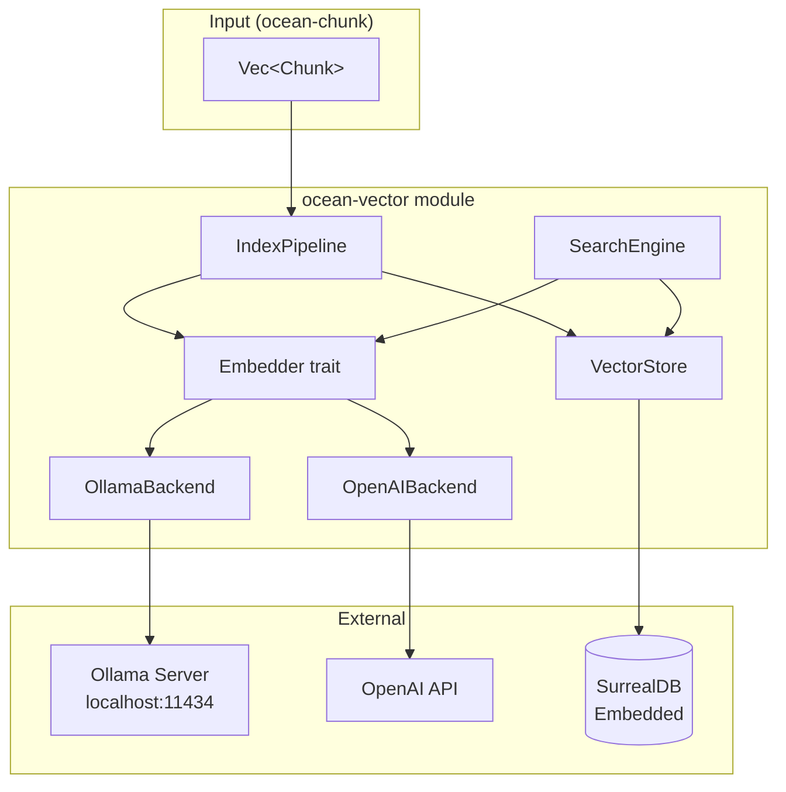

# Design Document: ocean-vector

## Overview

ocean-vector is the semantic memory layer: it takes chunks from ocean-chunk, embeds them using a pluggable model, stores both the chunk record and its vector in SurrealDB, and provides similarity search. This is the first index built on top of the chunk pipeline.

### Key Design Decisions

- **Decision 1 — SurrealDB as the unified backend**: Instead of separate SQLite + ANN library + FTS engine, SurrealDB provides vector storage (HNSW indexes), document records, full-text search, and graph operations in a single ACID-compliant engine. This simplifies the architecture dramatically and aligns with the DRT vision of a local knowledge operating system.

- **Decision 2 — Pluggable embedder abstraction**: The `Embedder` trait decouples embedding from storage. Ollama is the primary backend (local, private), with OpenAI-compatible as the alternative. This allows users to choose based on their privacy/quality requirements without changing the rest of the system.

- **Decision 3 — Batch embedding in the pipeline**: The indexing pipeline processes chunks in batches for efficiency. This is critical because embedding API calls (especially local Ollama) benefit from batched requests for throughput.

- **Decision 4 — Idempotent pipeline with skip logic**: The pipeline checks if a chunk already has an embedding for the current model before calling the embedder. This makes incremental indexing efficient — only new or changed chunks get embedded.

- **Decision 5 — HNSW index for ANN search**: SurrealDB's built-in HNSW index provides sub-50ms search at 100k+ chunks without needing a separate ANN library. The index is defined declaratively in the schema.

---

## Architecture



### Data Flow

```
Indexing:
  Vec<Chunk>  ──→  IndexPipeline  ──→  Embedder.embed_batch()
                                         │
                                         ↓
                                    VectorStore.insert()
                                         │
                                         ↓
                                    SurrealDB (chunk table + HNSW index)

Search:
  Query text  ──→  SearchEngine  ──→  Embedder.embed(query)
                                         │
                                         ↓
                                    VectorStore.search()  ──→  SurrealDB KNN query
                                         │
                                         ↓
                                    Vec<SearchResult>
```

---

## Components and Interfaces

### 1. Embedder Trait

The core abstraction for embedding models. All backends implement this trait.

```rust
pub trait Embedder: Send + Sync {
    fn embed(&self, text: &str) -> Result<Vec<f32>, EmbedderError>;

    fn embed_batch(&self, texts: &[&str]) -> Result<Vec<Vec<f32>>, EmbedderError>;

    fn dimension(&self) -> usize;

    fn model_name(&self) -> &str;
}
```

### 2. OllamaEmbedder

Connects to a local Ollama server via HTTP.

```rust
pub struct OllamaEmbedder {
    url: String,
    model: String,
    dimension: usize,
    client: reqwest::Client,
}

impl OllamaEmbedder {
    pub fn new(model: &str, url: &str) -> Result<Self, EmbedderError>;

    pub fn with_timeout(model: &str, url: &str, timeout_secs: u64) -> Result<Self, EmbedderError>;
}
```

**Ollama API contract** (`POST /api/embed`):
- Request: `{ "model": "nomic-embed-text", "input": ["text1", "text2", ...] }`
- Response: `{ "model": "...", "embeddings": [[f32; N], ...] }`

### 3. OpenAIEmbedder

Connects to any OpenAI-compatible embedding API.

```rust
pub struct OpenAIEmbedder {
    base_url: String,
    api_key: String,
    model: String,
    dimension: usize,
    client: reqwest::Client,
}

impl OpenAIEmbedder {
    pub fn new(model: &str, base_url: &str, api_key: &str) -> Result<Self, EmbedderError>;

    pub fn with_dimension(model: &str, base_url: &str, api_key: &str, dimension: usize) -> Result<Self, EmbedderError>;
}
```

**OpenAI API contract** (`POST /v1/embeddings`):
- Request: `{ "model": "text-embedding-3-small", "input": ["text1", "text2", ...] }`
- Response: `{ "data": [{ "embedding": [f32; N], "index": 0 }, ...], "model": "..." }`

### 4. VectorStore

SurrealDB-backed store for chunk records with vector fields.

```rust
pub struct VectorStore {
    db: Surreal<surrealdb::engine::local::Db>,
    ns: String,
    db_name: String,
}

impl VectorStore {
    pub async fn new_memory() -> Result<Self, StoreError>;

    pub async fn new_persistent(path: &str) -> Result<Self, StoreError>;

    pub async fn initialize_schema(&self) -> Result<(), StoreError>;

    pub async fn insert_chunk(&self, chunk: ChunkRecord, embedding: Vec<f32>) -> Result<(), StoreError>;

    pub async fn insert_chunks_batch(&self, records: Vec<(ChunkRecord, Vec<f32>)>) -> Result<(), StoreError>;

    pub async fn get_chunk(&self, chunk_id: &str) -> Result<Option<ChunkRecord>, StoreError>;

    pub async fn delete_chunks_by_file(&self, file_id: &str) -> Result<u64, StoreError>;

    pub async fn count(&self) -> Result<u64, StoreError>;
}
```

### 5. SearchEngine

Provides vector and hybrid search over indexed chunks.

```rust
pub struct SearchEngine {
    store: VectorStore,
}

impl SearchEngine {
    pub fn new(store: VectorStore) -> Self;

    pub async fn search(
        &self,
        query: &str,
        embedder: &dyn Embedder,
        top_k: usize,
    ) -> Result<Vec<SearchResult>, SearchError>;

    pub async fn hybrid_search(
        &self,
        query: &str,
        embedder: &dyn Embedder,
        top_k: usize,
    ) -> Result<Vec<SearchResult>, SearchError>;

    pub async fn filtered_search(
        &self,
        query: &str,
        embedder: &dyn Embedder,
        filter: &SearchFilter,
        top_k: usize,
    ) -> Result<Vec<SearchResult>, SearchError>;
}
```

### 6. IndexPipeline

Orchestrates chunk → embed → store.

```rust
pub struct IndexPipeline {
    store: VectorStore,
}

impl IndexPipeline {
    pub fn new(store: VectorStore) -> Self;

    pub async fn index_chunks(
        &self,
        chunks: Vec<Chunk>,
        embedder: &dyn Embedder,
        config: &IndexConfig,
    ) -> Result<IndexReport, IndexError>;
}
```

---

## Data Models

### ChunkRecord (SurrealDB document)

Stored as a SurrealDB record in the `chunk` table.

| Field | SurrealDB Type | Description |
|-------|---------------|-------------|
| `id` | `string` | Chunk ID (UUIDv7) — used as SurrealDB record ID |
| `file_id` | `string` | Source file ID (UUIDv7) |
| `content` | `string` | Chunk text content |
| `heading` | `option<string>` | Nearest heading context |
| `page` | `option<int>` | Page number (PDF/DOCX) |
| `slide` | `option<int>` | Slide number (PPTX) |
| `sheet` | `option<string>` | Sheet name (XLSX) |
| `block_type` | `string` | Type: Text/Heading/Table/Slide/Sheet/Image/etc. |
| `embedding` | `array<float>` | Vector embedding |
| `model` | `string` | Embedding model name |
| `dimension` | `int` | Embedding dimension |
| `content_hash` | `string` | SHA-256 of chunk content (for change detection) |
| `created_at` | `datetime` | Index timestamp |

### SurrealDB Schema

```surql
DEFINE TABLE chunk SCHEMAFULL;

DEFINE FIELD file_id ON TABLE chunk TYPE string;
DEFINE FIELD content ON TABLE chunk TYPE string;
DEFINE FIELD heading ON TABLE chunk TYPE option<string>;
DEFINE FIELD page ON TABLE chunk TYPE option<int>;
DEFINE FIELD slide ON TABLE chunk TYPE option<int>;
DEFINE FIELD sheet ON TABLE chunk TYPE option<string>;
DEFINE FIELD block_type ON TABLE chunk TYPE string;
DEFINE FIELD embedding ON TABLE chunk TYPE array<float>;
DEFINE FIELD model ON TABLE chunk TYPE string;
DEFINE FIELD dimension ON TABLE chunk TYPE int;
DEFINE FIELD content_hash ON TABLE chunk TYPE string;
DEFINE FIELD created_at ON TABLE chunk TYPE datetime;

DEFINE INDEX idx_embedding ON TABLE chunk FIELDS embedding
  HNSW DIMENSION 768 DIST COSINE;

DEFINE ANALYZER ocean_fts TOKENIZERS class, blank, punct
  FILTERS lowercase, ascii;

DEFINE INDEX idx_content_fts ON TABLE chunk FIELDS content
  FULLTEXT ANALYZER ocean_fts;

DEFINE INDEX idx_file_id ON TABLE chunk FIELDS file_id;
```

### SearchResult

```rust
pub struct SearchResult {
    pub chunk_id: String,
    pub file_id: String,
    pub content: String,
    pub heading: Option<String>,
    pub score: f32,
    pub block_type: String,
    pub vector_score: Option<f32>,
    pub fts_score: Option<f32>,
}
```

### SearchFilter

```rust
pub struct SearchFilter {
    pub file_id: Option<String>,
    pub heading_prefix: Option<String>,
    pub block_type: Option<String>,
    pub created_after: Option<chrono::DateTime<chrono::Utc>>,
    pub created_before: Option<chrono::DateTime<chrono::Utc>>,
}

impl SearchFilter {
    pub fn new() -> Self;

    pub fn with_file_id(mut self, id: &str) -> Self;

    pub fn with_heading(mut self, prefix: &str) -> Self;

    pub fn with_block_type(mut self, type_name: &str) -> Self;

    pub fn with_created_range(
        mut self,
        after: chrono::DateTime<chrono::Utc>,
        before: chrono::DateTime<chrono::Utc>,
    ) -> Self;
}
```

### IndexConfig

```rust
pub struct IndexConfig {
    pub batch_size: usize,
    pub reindex: bool,
    pub model: String,
    pub dimension: usize,
    pub ollama_url: Option<String>,
    pub openai_api_key: Option<String>,
    pub db_path: String,
}

impl Default for IndexConfig {
    fn default() -> Self {
        Self {
            batch_size: 10,
            reindex: false,
            model: "nomic-embed-text".into(),
            dimension: 768,
            ollama_url: Some("http://localhost:11434".into()),
            openai_api_key: None,
            db_path: "ocean.db".into(),
        }
    }
}
```

### IndexReport

```rust
pub struct IndexReport {
    pub total: usize,
    pub embedded: usize,
    pub skipped: usize,
    pub failed: usize,
    pub duration_ms: u64,
    pub errors: Vec<IndexError>,
}
```

---

## SurrealQL Query Examples

### KNN Vector Search

```surql
SELECT id, file_id, content, heading, block_type,
       vector::distance::cosine(embedding, $query_vec) AS score
FROM chunk
WHERE embedding <|10|> $query_vec
ORDER BY score ASC;
```

### Filtered KNN Search

```surql
SELECT id, file_id, content, heading, block_type,
       vector::distance::cosine(embedding, $query_vec) AS score
FROM chunk
WHERE file_id = $file_id
  AND embedding <|10|> $query_vec
ORDER BY score ASC;
```

### Full-Text Search

```surql
SELECT id, file_id, content, heading, block_type,
       search::score(1) AS fts_score
FROM chunk
WHERE content @1@ $query
ORDER BY fts_score DESC;
```

### Hybrid Search (RRF)

```surql
-- Vector results
(SELECT id, content, vector::distance::cosine(embedding, $query_vec) AS score
 FROM chunk WHERE embedding <|10|> $query_vec)
UNION
-- FTS results
(SELECT id, content, search::score(1) AS score
 FROM chunk WHERE content @1@ $query)
-- RRF fusion happens in Rust code after fetching both result sets
```

---

## Correctness Properties

### Property 1: Vector Index Determinism

*For any* fixed set of chunks and a fixed embedder, indexing the same chunks twice SHALL produce identical vector values in SurrealDB.

**Validates:** R5

### Property 2: Search Round-Trip

*For any* chunk C indexed with embedding V, searching with a query that embeds to a vector similar to V SHALL return C within the top-K results.

**Validates:** R6

### Property 3: Idempotent Re-Index

*For any* set of chunks, running `index_chunks` twice with identical content and model SHALL produce the same SurrealDB state (no duplicate records, same embeddings).

**Validates:** R5.5

### Property 4: Hybrid Rank Fusion

*For any* query Q, the `hybrid_search` result set SHALL be a superset of the individual vector and FTS result sets (no result from either branch is lost in fusion).

**Validates:** R7

### Property 5: Embedder Isolation

*For any* `Embedder` implementation, the `embed` function SHALL return vectors of exactly `dimension()` length, and all elements SHALL be finite `f32` values.

**Validates:** R1

### Property 6: Filter Correctness

*For any* search with a filter F, every result SHALL satisfy all conditions in F. No result SHALL violate a filter predicate.

**Validates:** R8

### Property 7: Batch Integrity

*For any* batch of N chunks indexed together, if the pipeline returns `Ok`, all N chunks SHALL be findable in SurrealDB. Partial failures SHALL be reported in `IndexReport.failed`.

**Validates:** R5.6

---

## Error Handling

| Scenario | Behaviour |
|----------|-----------|
| Ollama server unreachable | EmbedderError::ConnectionFailed — returned to caller |
| OpenAI API key invalid | EmbedderError::AuthenticationFailed — returned to caller |
| Embedder rate limited | EmbedderError::RateLimited with retry-after hint |
| SurrealDB connection fails | StoreError::ConnectionFailed — includes underlying error |
| Chunk not found by ID | StoreError::RecordNotFound |
| Invalid embedding dimension | EmbedderError::ModelReturnedError — vector length != dimension() |
| Batch partial failure | IndexPipeline continues, records per-chunk errors in IndexReport |
| SurrealQL syntax error | StoreError::QueryFailed with SurrealDB error detail |

---

## Testing Strategy

### Unit Tests

- Embedder trait contract tests (all backends must pass same set of assertions)
- Ollama mock server tests (wiremock or similar HTTP mock)
- OpenAI mock server tests
- SearchFilter builder correctness
- IndexConfig defaults
- Vector normalization correctness
- RRF score computation

### Integration Tests

- SurrealDB in-memory store: full CRUD cycle
- Index then search round-trip (embed → store → search → verify)
- Hybrid search produces superset of individual results
- Filtered search correctness
- Batch indexing with partial failures
- Re-index idempotency (index twice, verify no duplicates)

### Real File Integration

- Full pipeline: scan directory → parse files → chunk → embed → store → search
- Verify end-to-end with test-cwd/ fixtures

### Property-Based Tests

- Embedder trait: for any text, embed returns dimension()-length vector with finite values
- SurrealDB store: insert + get roundtrip for any valid ChunkRecord
- SearchFilter: any valid filter produces valid SurrealQL WHERE clause
